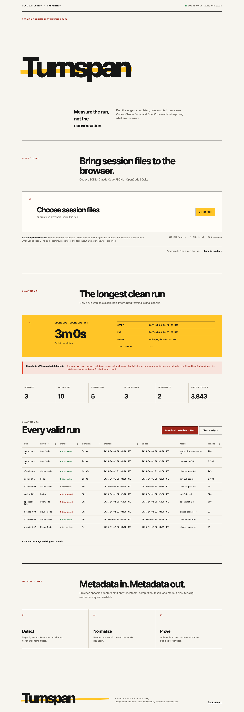

# Turnspan

**Measure the run, not the conversation.**

Turnspan is a static, browser-only analyzer for Codex, Claude Code, and
OpenCode session sources. It extracts execution metadata—start, end, duration,
token counts, model, and completion state—and identifies the longest completed,
uninterrupted run.

Prompts, responses, reasoning text, tool input, and tool output are never shown
or exported.



## Privacy model

```text
Local file
  → dedicated browser Worker
  → provider-specific allowlisted parser
  → normalized metadata only
  → UI / metadata JSON export
```

- No session data is uploaded.
- No analytics, remote fonts, CDN assets, crash reporting, or API calls exist.
- No cookies, localStorage, sessionStorage, IndexedDB, Cache Storage, OPFS, or
  service worker is used.
- Filenames, paths, session IDs, message IDs, and project names do not cross the
  Worker/UI boundary.
- OpenCode SQLite queries use `json_extract()` for approved metadata fields and
  never select raw message content.
- Errors are static and aggregated; source lines and database rows are never
  reflected into the page or console.

See [Privacy and threat model](docs/privacy.md).

## Supported sources

| Provider | Input | Run boundary | Strong completion evidence |
| --- | --- | --- | --- |
| Codex | Session `.jsonl` | `task_started` / `turn_started` to matching terminal event | `task_complete` / `turn_complete` without a recorded error |
| Claude Code | Project or subagent `.jsonl` | Human user message through the turn terminal record | `system/turn_duration`, or terminal assistant stop fallback |
| OpenCode | `opencode.db`, `.sqlite`, or `.db` | User message plus its assistant/model-step sequence | Completed assistant time plus an allowlisted clean finish and no error |

Detection uses SQLite magic bytes or known JSONL record structures, not the
filename extension.

Detailed semantics and limits are in the [support matrix](docs/support.md).

### OpenCode WAL note

Current OpenCode uses SQLite WAL mode. A lone `opencode.db` can omit newer
committed records that still live in `opencode.db-wal`. Turnspan can read a
checkpointed WAL-header database by normalizing a copy in memory and running
`PRAGMA integrity_check`, but it cannot reconstruct missing WAL frames.

For the freshest portable source, close OpenCode and make a consistent backup:

```bash
sqlite3 "/path/to/opencode.db" ".backup '/tmp/opencode-snapshot.db'"
```

Select `/tmp/opencode-snapshot.db` in Turnspan. Never commit a real session
database to this repository.

## Development

Prerequisites:

- [Bun](https://bun.sh/)
- Chromium installed for Playwright (`bunx playwright install chromium`)
- `sqlite3` CLI only when regenerating the sanitized OpenCode fixture

```bash
bun install
bun run dev
```

Useful commands:

```bash
bun run test       # deterministic parser and privacy tests
bun run check      # strict TypeScript check
bun run build      # production static build
bun run test:e2e   # build + Playwright desktop/mobile tests
bun run verify     # full verification
```

The production artifact is emitted to `dist/` and requires only static hosting.
The application does not have or need a backend.

## Sanitized fixtures

`tests/fixtures/` contains synthetic fixtures shaped from official schemas and
schema-only inspection of current local installations:

- Codex stable and forward-compatible event aliases, cumulative tokens, and
  interruption.
- Claude Code duplicate assistant updates, tool results, `turn_duration`, API
  errors, interruptions, pending background work, and sidechain-only records.
- A checkpointed OpenCode WAL-header database containing both legacy `message`
  and current `session_message` schemas.
- A transitional OpenCode database without `session_message.seq`, including
  partial mixed migration data and a token-limit finish.

Every fixture places `TURNSPAN_PRIVATE_CANARY_7f3b` inside prompt, response, or
tool-output fields. Unit and Playwright tests assert that the canary is absent
from normalized results, DOM, ARIA output, console messages, and downloads.

## Verification snapshot

The Playwright suite runs the production build in Chromium at:

- Desktop: `1440 × 1000`
- Mobile: `390 × 844`
- Narrow reflow check: `320 × 800`

It verifies:

- local file input for Codex, Claude Code, and OpenCode together;
- zero network requests from analysis start to result;
- zero WebSockets and blocked service workers;
- no browser persistence;
- privacy canary exclusion from every output surface;
- JSON export allowlisting;
- no horizontal overflow;
- visible keyboard focus and a stable local-only accessibility label;
- fail-closed behavior for unsupported input.

Screenshots are committed in [docs/screenshots](docs/screenshots).

## Research and licensing

The implementation is a clean-room TypeScript design informed by official
provider source and permissively licensed analyzers. No upstream parser code or
fixtures were copied.

- [Research sources and OSS review](docs/research.md)
- [Third-party notices](THIRD_PARTY_NOTICES.md)
- Project license: [MIT](LICENSE)

Turnspan is an independent Team Attention × Ralphthon utility and is not
affiliated with OpenAI, Anthropic, or OpenCode.
